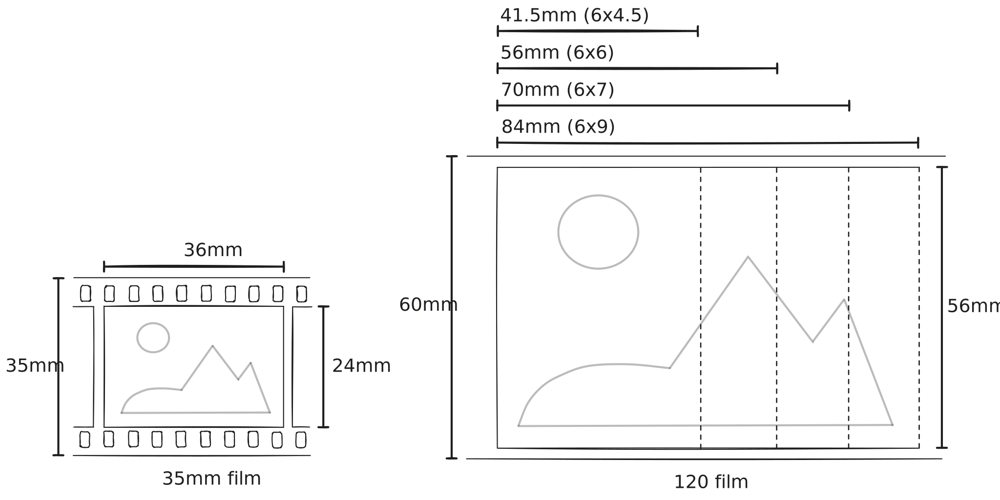

# List of illustrations

### Film format diagram
{.svg-img}

This diagram compares the frame sizes of 35mm and 120 medium format film. 
On the left, 35mm film has a fixed frame size of 36×24mm with perforations along the edges. 
On the right, 120 film is wider at 60mm and supports multiple frame sizes, including 6×4.5cm, 6×6cm, 6×7cm, and 6×9cm. 
Unlike 35mm, 120 film does not have perforations and offers larger negatives, which capture more detail and produce higher-quality images with less grain.